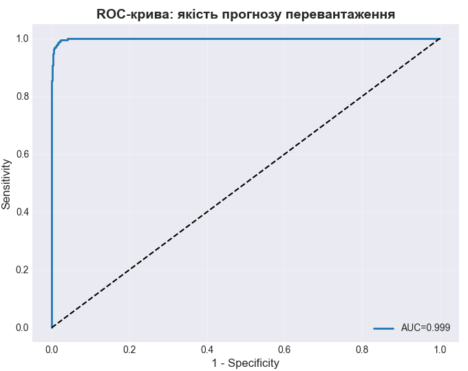
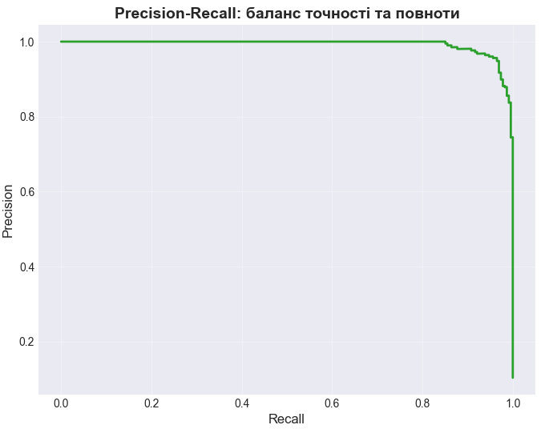
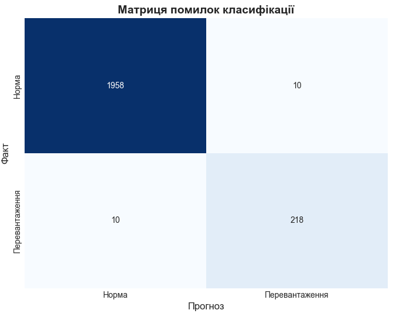
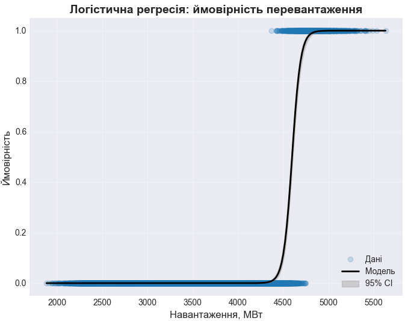
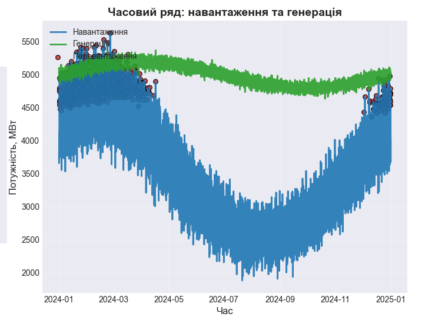

# Logistic Regression – Система моніторингу перевантажень енергосистеми

Цей проєкт реалізує інтерактивний дашборд для **моніторингу та прогнозування перевантажень енергосистеми** на основі **логістичної регресії**.

## 🔹 Можливості
- Побудова **ROC-кривої** та обчислення AUC для оцінки якості моделі.
- Побудова **Precision-Recall кривої** для аналізу балансу точності та повноти.
- Візуалізація **матриці помилок класифікації**.
- Побудова **логістичної S-кривої** з довірчими інтервалами.
- Відображення **часового ряду** навантаження та генерації з позначенням перевантажень.
- Інтерактивне меню (RadioButtons) для перемикання між графіками в одному вікні.

## 🔹 Встановлення
1. Клонувати репозиторій:
```bash
git clone https://github.com/username/logistic-regression.git
cd logistic-regression
```

2. Встановити залежності:
```bash
pip install -r requirements.txt
```

## 🔹 Запуск
```bash
python Python.py
```

Після запуску відкриється інтерактивне вікно з графіками.  
Зліва буде меню, де можна перемикатися між:
 ## ROC-кривою

 ## Precision-Recall кривою
 
 ## Матрицею помилок
 
 ## Логістичною регресією
 
 ## Часовим рядом
 

## 🔹 Використані бібліотеки
- pandas
- numpy
- scikit-learn
- matplotlib
- seaborn
- statsmodels


